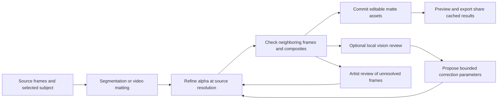

# Production AI integration

Primary sources checked 2026-10-03. Models below are candidates, not finished artist
features. Native SAM 2.1 and RVM feasibility adapters are measured in
[R0 inference evidence](evidence/r0-inference/README.md), with exact artifact,
runtime and license pins. Other candidates remain unimplemented.
Pin code/artifact/license revisions again when implementing each adapter.
Evaluate Meta's general-purpose models alongside the user's portrait/matting/depth
candidates by production role. Model quality must be demonstrated on EditBay's
footage. A universal best-model claim is not established here.

## Candidate map

| Model/tool | Useful production role | Verified boundary | Production decision |
| --- | --- | --- | --- |
| [SAM 3 / 3.1](https://github.com/facebookresearch/sam3) | Promptable image/video object masks, detection, identity tracking | Custom [SAM License](https://github.com/facebookresearch/sam3/blob/main/LICENSE); official setup uses Python/PyTorch/CUDA and gated checkpoint access | First auto-roto/object-track candidate; native artifact/runtime feasibility required |
| [SAM 2 / 2.1](https://github.com/facebookresearch/sam2) | Prompted temporal segmentation | Apache-2.0 repository; model/download terms and exact artifacts still need pinning | Evaluate smaller/native-portable fallback and compare temporal results |
| [CoTracker3](https://github.com/facebookresearch/co-tracker) | Point trajectories and visibility through video | Repository [LICENSE.md](https://github.com/facebookresearch/co-tracker/blob/main/LICENSE.md) is CC BY-NC 4.0 | Research reference; not enabled for commercial client work without suitable permission/replacement |
| [SAM 3D Body](https://github.com/facebookresearch/sam-3d-body) | Single-image human pose/mesh recovery | Custom [SAM License](https://github.com/facebookresearch/sam-3d-body/blob/main/LICENSE); estimates body/feet/hands with MHR | Input to editable human-rig reconstruction; temporal fitting and retargeting are separate work |
| [MHR](https://github.com/facebookresearch/MHR) | Parametric human mesh, skeleton, skin/pose correctives | Current [LICENSE](https://github.com/facebookresearch/MHR/blob/main/LICENSE) is Apache-2.0; README offers a TorchScript artifact | Strong rig candidate; validate native evaluation, asset terms, channels and export mapping |
| [Momentum](https://github.com/facebookresearch/momentum) | Kinematic motion and optimization solvers | Current [LICENSE](https://github.com/facebookresearch/momentum/blob/main/LICENSE) is MIT; native C++ library | Evaluate a narrow Rust/native adapter for fitting and rig operations |
| [SAM 3D Objects](https://github.com/facebookresearch/sam-3d-objects) | Single-image shape/texture/layout reconstruction | Custom [SAM License](https://github.com/facebookresearch/sam-3d-objects/blob/main/LICENSE) | Image-to-asset candidate; does not supply general character auto-rigging by itself |
| [SAM Audio](https://github.com/facebookresearch/sam-audio) | Prompted audio source separation | Custom [SAM Audio License](https://github.com/facebookresearch/sam-audio/blob/main/LICENSE), checkpoint/runtime dependencies | Sound-post candidate with native feasibility, actual stem quality and explicit license/artifact checks |

No-charge downloadable weights, unrestricted commercial redistribution, and
zero-cost inference are different properties. Record them separately. SAM-family
custom licenses require retaining terms and checking the planned redistribution/
conversion route. CoTracker's noncommercial restriction is a concrete difference
from the other candidates. Hosted APIs are separate services and are not assumed
free or made necessary for local authoring.

## Additional portrait, matting, and depth candidates

The supplied model menu names match the [OBS background-removal catalog](https://github.com/royshil/obs-backgroundremoval/blob/master/src/consts.h).
That catalog points to native ONNX artifacts; it is useful provenance, not proof
of EditBay runtime compatibility or rights to every converted weight file.
MediaPipe is a framework/family, so its menu label must resolve to an exact model
artifact rather than be counted as an independent algorithm by name alone.

| Supplied name | Production role | Verified source/terms and decision |
| --- | --- | --- |
| SINet | Lightweight portrait/person foreground selection | [Author implementation](https://github.com/clovaai/ext_portrait_segmentation) has [MIT terms](https://github.com/clovaai/ext_portrait_segmentation/blob/master/LICENSE); the [conversion source cited by OBS](https://github.com/anilsathyan7/Portrait-Segmentation/tree/master/SINet) also lives in an MIT repository. Pin the actual weights/export lineage; evaluate a low-cost selection/preview route, not assume fine alpha. |
| MediaPipe | Meet/portrait segmentation candidate; exact family member depends on artifact | [MediaPipe](https://github.com/google-ai-edge/mediapipe) code is Apache-2.0. OBS distinguishes `mediapipe.onnx` from selfie artifacts. Pin model-card/weight/conversion terms independently of the framework license. |
| Selfie Segmentation | Lightweight people/background mask | [Google guide](https://developers.google.com/edge/mediapipe/solutions/vision/image_segmenter) documents square 256×256 and landscape 144×256 inputs. Useful preview/selection candidate; extra inference time does not restore edge detail lost at that input scale. |
| Selfie Multiclass | Separate hair/skin/clothes/accessory regions | The same Google guide documents six classes at 256×256. Evaluate region-specific correction, grading and refinement hints; class probabilities are not a finished opacity matte. Exact artifact terms/runtime still need pinning. |
| PP-HumanSeg | Portrait/general-human segmentation and native fallback evaluation | [PaddleSeg implementation](https://github.com/PaddlePaddle/PaddleSeg/tree/release/2.7/contrib/PP-HumanSeg) is under [Apache-2.0](https://github.com/PaddlePaddle/PaddleSeg/blob/release/2.7/LICENSE). Its deployment guide distinguishes softmax/argmax outputs and includes optical-flow postprocessing. Retain useful soft outputs, then validate a native export and the particular model variant. |
| Robust Video Matting (RVM) | Human foreground plus soft alpha with temporal memory | [Official implementation](https://github.com/PeterL1n/RobustVideoMatting) has [GPL-3.0 code](https://github.com/PeterL1n/RobustVideoMatting/blob/master/LICENSE) and [official ONNX inference](https://github.com/PeterL1n/RobustVideoMatting/blob/master/documentation/inference.md). Strong offline human-matting candidate. GPL is not a noncommercial ban; settle applicable code/artifact distribution obligations before shipping. |
| TCMonoDepth | Stable relative video depth for depth effects/auxiliary selection | [Author implementation](https://github.com/yu-li/TCMonoDepth) has [MIT terms](https://github.com/yu-li/TCMonoDepth/blob/main/LICENSE). Depth is neither subject identity nor alpha; use it as an optional cue and for depth-aware effects, with occlusion/scale validation. |

Human-specific candidates complement SAM's arbitrary-object selection. They do
not replace object roto, camera/planar solving, or all scene types. The measured
SAM 2.1/RVM prototypes establish native feasibility and numerical agreement on
named fixtures; they do not establish production matte or mask quality.

## Offline matte finishing and optional local vision review

The user's proposed workflow removes the live-stream frame deadline: process
every source frame, spend more time on difficult edges, inspect adjacent frames,
and hand off committed results. This enables refinement and look-ahead, but
does not by itself increase a fixed-resolution model's accuracy.

### Processing and temporal ownership

- Decode the selected shot at original source timestamps; detect cuts and changes
  of subject. Never base the final matte on whichever frames the viewer happened
  to display. Derive model input in the adapter's expected RGB/range/resize space,
  while retaining the original color-managed image for composition.
- For RVM, carry its recurrent states through frames in order. Reset at cuts or
  deliberate segment boundaries; preserve state checkpoints for resume/seek.
  Replaying from a checkpoint must match an uninterrupted pass within a recorded
  numerical tolerance. Parallelize independent shots; do not treat stateful video
  inference as unrelated still-image calls.
- Give native source-resolution refinement the original image and useful soft
  masks/alpha. Construct foreground/background/unknown regions where a chosen
  matting refiner requires them. Preserve hair, translucent edges, defocus and
  motion blur; avoid turning alpha into a hard thresholded silhouette.
- Keep a segmentation probability, category label, depth map, foreground RGB
  estimate, and opacity alpha as distinct result types. A soft person score is
  not automatically physical opacity. Keep foreground cleanup/despill reversible
  and document alpha premultiplication and color transforms.
- Check motion-aligned neighboring frames for edge jitter, leakage and ghosting.
  Do not blindly average masks: subject movement/occlusion needs motion and
  visibility handling. Future-frame or reverse-pass refinement is an experiment
  with its own comparison gate, not a guaranteed improvement.

RVM's official ONNX contract explicitly includes recurrent inputs/outputs plus
foreground/alpha outputs. Its downsample ratio belongs to the inference
configuration. A change that alters state shapes/configuration requires a
validated reset/replay; it is not an arbitrary postprocessing slider.
[Reference contract](https://github.com/PeterL1n/RobustVideoMatting/blob/master/documentation/inference.md).

### Local vision model as an optional correction controller

Evaluate a local vision model looking at the original image, enlarged boundary
crops, alpha/uncertainty views, composites over contrasting backgrounds, and
neighboring frames. It can propose region/frame-specific parameter changes,
identify missing fingers/hair or spill, request a stronger refinement pass,
and mark frames for artist attention. It does not invent unseen source pixels.

Keep its outputs structured and bounded: region, source frame/range, edge grow/
shrink, refinement radius, decontamination strength, and reason. Apply these
through the ordinary revision/undo command path. Preserve manually corrected
regions, limit iteration count, and discard stale job proposals. Proposed changes
must be scored/reviewed before they become committed matte assets.

Parameter tracks need spatial limits and temporal regularization within a shot;
independent per-frame feather/threshold changes can themselves cause pumping.
The matte/refinement model performs pixel-level estimation. A general vision
model's usefulness as a controller is an unproven hypothesis: measure its
incremental benefit over dedicated refinement and deterministic quality checks.
Select a specific local reviewer only after artifact/license, native-runtime,
memory, crop-detail and correction-accuracy evaluation.

### Handoff and quality gate

Separate a quick preview from a final offline analysis job. The final job exposes
scope, progress, cancellation/resume and approximate storage/compute needs.
Cache original source-time masks, refined float alpha/foreground assets, editable
correction curves, model/runtime/configuration fingerprints and review notes.
If the artist edits a correction, invalidate the affected range plus any required
temporal dependency span; a grade-only change need not rerun matting.

The compositor and export consume the same committed assets. Recipients can use
them without running a vision model or owning the original inference hardware.
Visual handoff includes playback over black/white/checkerboard and the intended
background; unresolved ranges stay visible rather than silently count as approved.

Compare on a fixed shot set: (1) raw lightweight masks, (2) RVM or another approved
matting route, (3) source-resolution refinement with temporal checks, and (4) the
same pipeline plus a local vision controller. Measure boundary/alpha error where
ground truth exists, motion-aligned flicker, halos/leakage, foreground color errors,
artist correction time, wall time and peak memory. Include hair, hands, translucent
materials, fast movement, camera motion, occlusion, multiple people and cuts.
Only promote the controller if it improves the outcome at an acceptable cost.

## Rust shipping contract

The artist installs a native application and approved model packs. They do not
install Python, Conda, pip packages, or run research notebooks. Native runtime
candidates include ONNX Runtime through Rust bindings, libtorch through native
bindings for compatible artifacts, or a validated native implementation. Select
the runtime after measuring portability and fidelity, not by assuming every
checkpoint exports to ONNX.

SAM 3's documented reference setup requires Python 3.12+, PyTorch, and CUDA.
Video propagation includes state and supporting operations beyond a single
forward tensor call. Reproduce those in a validated native adapter or obtain a
compatible upstream artifact. Dynamic shapes, custom kernels, quantization,
precision, preprocessing, and postprocessing require reference comparisons.
No Python subprocess fallback ships behind a Rust button.

Before an adapter is eligible for production:

1. Record model/code revisions, approved weight URLs, hashes, attribution,
   redistribution/use terms, and native runtime/operator requirements.
2. Verify an authorized native artifact route and reference-output agreement.
3. Measure actual latency, peak RAM/VRAM, quality, and long-video state growth
   for NVIDIA, AMD, Intel, CPU, and ARM64 where the route claims support.
4. Keep unsupported backends explicit. Provide manual tools; inference availability
   cannot block project open, correction, or export of cached results.
5. Download models as optional verified packs, with cancellation/retry, disk-space
   estimates, a persistent failure explanation, and no automatic cloud upload.

## Artist workflows

### Select → propagate → correct → use

Click/box/text selects a subject; propagate through a chosen frame range; review
occlusion/reappearance and confidence; correct anchor frames; refine edges;
attach the resulting matte to grades, effects, composites, and exports. Masks
are persistent editable assets attached to source-time identities. Trim, slip,
reverse, speed ramps, nesting, and source replacement have explicit remapping.

Segmentation masks do not automatically provide finished hair/defocus/motion-
blurred alpha. Include edge/matting refinement and artist overrides, with a
separate cleared model or deterministic algorithm when necessary.

### Track → solve → attach

Object masks can anchor tracking but do not replace point/planar/camera solvers.
Use cleared native feature/KLT/homography/optimization algorithms as a commercial
baseline while evaluating learned candidates. Expose visibility, confidence,
failed frames, and correction keys. A track can drive a title, corner pin,
stabilization, mask, or camera only through a typed, reversible connection.

### Reconstruct → rig → fit motion → retarget

SAM 3D Body estimates a person from an image. MHR supplies an editable human
representation. EditBay must additionally solve temporal consistency, bone
hierarchy/skin mapping, foot contacts, constraints, pose correction, retargeting,
coordinates, and exports. Arbitrary characters need a separate auto-rigging and
skinning solution; SAM 3D Objects reconstruction does not complete that task.

### Isolate sound → audition → deliver

Separation should expose target/residual stems, alignment, model provenance,
audition and bypass, revisions, and correction/mix controls. Validate artifacts,
leakage, phase/timing and loudness against actual production sound. Results remain
reproducible assets independent of future model downloads.

## Persistent result and job model

Store source identity/hash, frame/sample range, prompts/correction keys, model
and runtime fingerprints, output transforms, visibility/confidence, and artist
edits. Cache raw useful results and finished mattes/tracks/rig data separately.
Do not recompute a whole shot for a downstream grade adjustment.

Jobs run outside the UI thread with progress, cancellation, chunk checkpoints,
resource limits, and resumable completion. A stale source/revision result cannot
overwrite corrected work. Portable projects include committed result assets so
client review/export does not require the original inference hardware.

## Evaluation gate

Build footage sets containing hair, transparent edges, defocus, motion blur,
occlusion, re-entry, similar subjects, camera shake, cuts, and speed changes.
Evaluate temporal stability and boundary/matte quality; trajectory error and
visibility; rig fitting, foot sliding, and retargeting error; sound leakage and
artifacts. Report artist correction time alongside model metrics and hardware
latency. Inspect representative frames and full motion playback. Model benchmark
claims do not substitute for these project-specific results.
